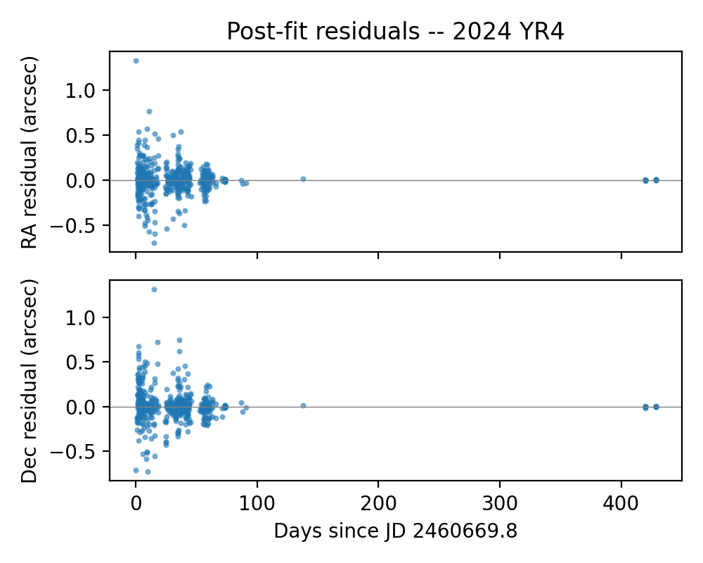
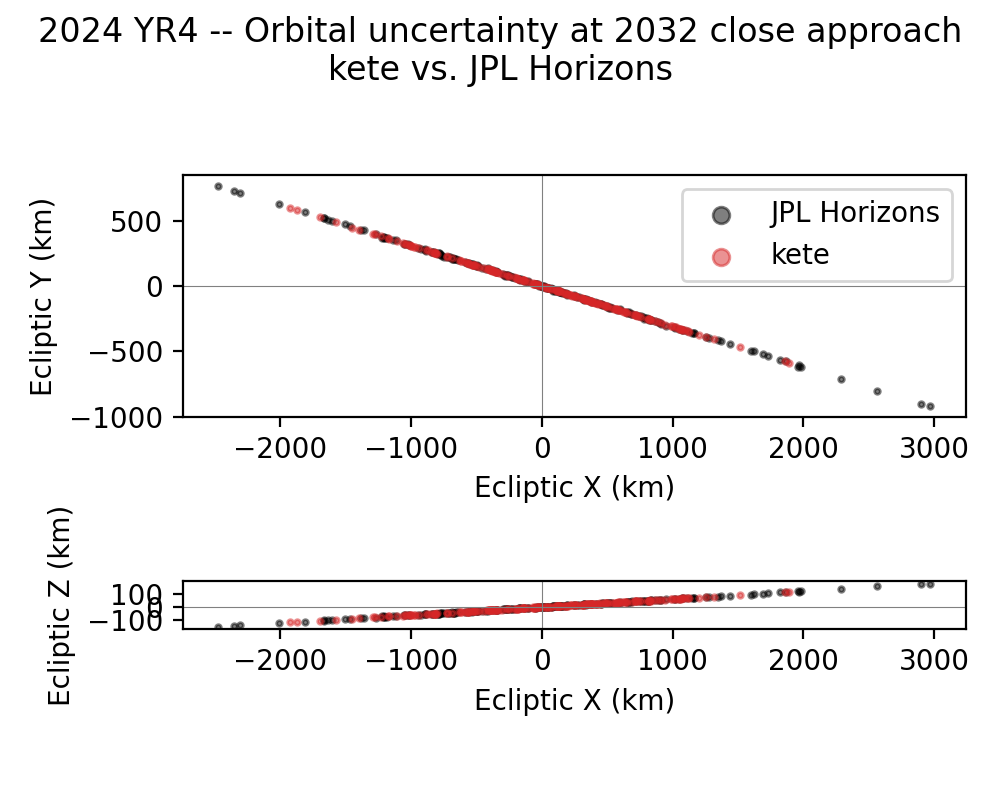
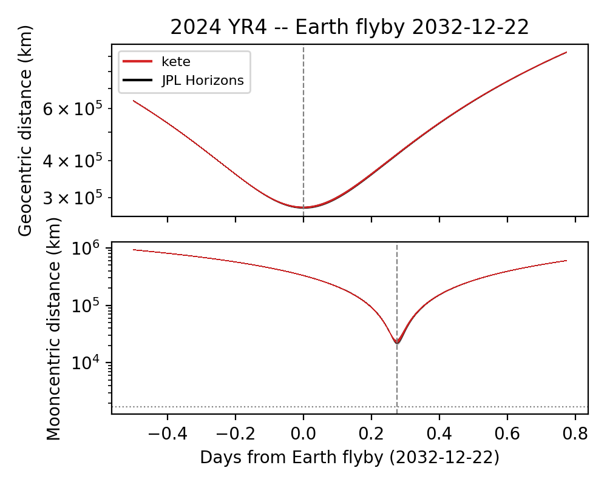

2024 YR4 - Orbit Determination from Real Observations
======================================================

Overview
--------

2024 YR4 is a near-Earth asteroid discovered on 2024 December 27 by the ATLAS
survey.  Its short initial arc placed it on an elevated-probability impact
list for 2032, which generated significant follow-up attention.  By early 2025
the impact was ruled out.

This tutorial uses real MPC ADES astrometry to walk through a standard orbit
determination:

1. Fetch optical observations from the Minor Planet Center.
2. Run Initial Orbit Determination (IOD) to get a starting orbit.
3. Refine with differential correction and inspect residuals.
4. Propagate the fitted orbit to the 2032 close-approach epoch.

.. note::

   This tutorial requires network access to the MPC ADES API.  Results will
   vary as new observations accumulate in the MPC archive.  Pass
   ``update_cache=True`` to :func:`~kete.orbit_fitting.fetch_mpc_observations`
   to refresh the local cache.

.. code-block:: python

    import matplotlib.pyplot as plt
    import numpy as np

    import kete

1. Fetch Observations
---------------------

:func:`~kete.orbit_fitting.fetch_mpc_observations` queries the MPC web API,
applies the EFCC18 star-catalog debiasing correction, assigns per-observatory
astrometric uncertainties, and returns a list of
:class:`~kete.orbit_fitting.Observation` objects ready for fitting.  Results
are cached locally under ``~/.kete/observations/``.

.. code-block:: python

    obs = kete.orbit_fitting.fetch_mpc_observations("2024 YR4")
    print(f"Fetched {len(obs)} observations")

    epochs = [o.epoch.jd for o in obs]
    arc_days = max(epochs) - min(epochs)
    t_start = kete.Time(min(epochs)).iso
    t_end   = kete.Time(max(epochs)).iso
    print(f"Arc: {t_start[:10]}  to  {t_end[:10]}  ({arc_days:.1f} days)")

::

    Fetched 512 observations
    Arc: 2024-12-25  to  2026-02-26  (428.6 days)

2. Initial Orbit Determination
--------------------------------

With real observations in hand we run IOD.
:func:`~kete.orbit_fitting.initial_orbit_determination` scans a grid of
topocentric distances across observation pairs, solves Lambert's problem at
each grid point, and scores the candidates by angular residual.  Candidates
are returned sorted best-first.

.. code-block:: python

    candidates = kete.orbit_fitting.initial_orbit_determination(obs)
    print(f"IOD returned {len(candidates)} candidate(s)")

    score, best = candidates[0]
    elem = best.elements
    print(f"Best candidate:  score={score:.3e}")
    print(f"  a = {elem.semi_major:.4f} AU")
    print(f"  e = {elem.eccentricity:.4f}")
    print(f"  i = {elem.inclination:.3f} deg")

::

    IOD returned 3 candidate(s)
    Best candidate:  score=2.355e-05
      a = 2.5623 AU
      e = 0.6649
      i = 3.390 deg

3. Differential Correction
---------------------------

:func:`~kete.orbit_fitting.fit_orbit` refines the IOD candidate against all
observations.  Internally it runs a sequence of windowed least-squares passes
to bootstrap convergence across the full arc, then applies outlier rejection
following the Carpino-Milani-Chesley (2003) algorithm.

.. code-block:: python

    fit = kete.orbit_fitting.fit_orbit(best, obs)

    print(f"Converged: {fit.converged}")
    print(f"RMS:       {fit.rms:.4f}")
    included = sum(fit.included)
    total    = len(fit.all_observations)
    print(f"Included:  {included} / {total} observations")

    elem = fit.state.elements
    print(f"Fitted elements:")
    print(f"  a = {elem.semi_major:.6f} AU")
    print(f"  e = {elem.eccentricity:.6f}")
    print(f"  i = {elem.inclination:.4f} deg")
    print(f"  q = {elem.peri_dist:.6f} AU")

::

    Converged: True
    RMS:       0.8633
    Included:  479 / 512 observations
    Fitted elements:
        a = 2.515890 AU
        e = 0.661415
        i = 3.4082 deg
        q = 0.851843 AU

4. Residual Analysis
---------------------

Post-fit residuals should scatter symmetrically around zero with no clear
trend in time.  A drift would suggest a force not included in the model.

.. code-block:: python

    residuals  = np.array(fit.residuals)
    epochs_inc = [o.epoch.jd for o, inc in
                  zip(fit.all_observations, fit.included) if inc]
    t0 = min(epochs_inc)

    fig, (ax1, ax2) = plt.subplots(2, 1, sharex=True, figsize=(5, 4), dpi=200)

    ax1.scatter(np.array(epochs_inc) - t0, residuals[:, 0], s=4, alpha=0.5)
    ax1.axhline(0, color="gray", lw=0.5)
    ax1.set_ylabel("RA residual (arcsec)")
    ax1.set_title("Post-fit residuals -- 2024 YR4")

    ax2.scatter(np.array(epochs_inc) - t0, residuals[:, 1], s=4, alpha=0.5)
    ax2.axhline(0, color="gray", lw=0.5)
    ax2.set_ylabel("Dec residual (arcsec)")
    ax2.set_xlabel(f"Days since JD {t0:.1f}")

    plt.tight_layout()
    plt.savefig("data/yr4_residuals.png")
    plt.close()

5. Positional Uncertainty vs. JPL Horizons
-------------------------------------------

We compare the spread of sampled orbits from the kete fit against the
published JPL Horizons covariance at the 2032 close-approach epoch.  Sampling
both covariances and propagating forward turns the abstract covariance matrix
into a concrete cloud of positions in km.  The X-Y and X-Z ecliptic projections
show whether the two fits agree in both the size and shape of their uncertainty
regions.

First locate the Earth close approach:

.. code-block:: python

    earth_now = kete.spice.get_state("Earth", fit.state.jd)
    ca_epoch, ca_dist = kete.closest_approach(
        fit.state,
        earth_now,
        kete.Time.from_ymd(2031, 1, 1),
        kete.Time.from_ymd(2033, 1, 1),
    )
    jd_ca   = ca_epoch.jd
    ca_date = kete.Time(jd_ca).iso[:10]
    print(f"Closest approach:  {ca_date}  "
          f"({ca_dist * kete.constants.AU_KM:.0f} km, "
          f"{ca_dist:.5f} AU)")

::

    Closest approach:  2032-12-22  (882932 km, 0.00590 AU)

.. code-block:: python

    horizons = kete.HorizonsProperties.fetch("2024 YR4")

    N_SAMPLES = 200
    k_samples, _ = fit.uncertain_state.sample(N_SAMPLES, seed=42)
    h_samples, _ = horizons.sample(N_SAMPLES, seed=42)

    # Propagate the nominal state and all samples to the close-approach epoch.
    k_nom_ca = kete.propagate_n_body(fit.state, jd_ca)
    h_nom_ca = kete.propagate_n_body(horizons.state, jd_ca)
    k_ca     = kete.propagate_n_body(k_samples, jd_ca)
    h_ca     = kete.propagate_n_body(h_samples, jd_ca)

    AU_KM = kete.constants.AU_KM

    fig, (ax1, ax2) = plt.subplots(2, 1, figsize=(5, 4), dpi=200)

    ax1.scatter(
        [(s.pos.x - h_nom_ca.pos.x) * AU_KM for s in h_ca],
        [(s.pos.y - h_nom_ca.pos.y) * AU_KM for s in h_ca],
        c="k", s=4, alpha=0.5, label="JPL Horizons",
    )
    ax1.scatter(
        [(s.pos.x - k_nom_ca.pos.x) * AU_KM for s in k_ca],
        [(s.pos.y - k_nom_ca.pos.y) * AU_KM for s in k_ca],
        c="tab:red", s=4, alpha=0.5, label="kete",
    )
    ax1.axhline(0, color="gray", lw=0.4)
    ax1.axvline(0, color="gray", lw=0.4)
    ax1.set_aspect("equal")
    ax1.set_xlabel("Ecliptic X (km)")
    ax1.set_ylabel("Ecliptic Y (km)")
    ax1.legend(markerscale=3)

    ax2.scatter(
        [(s.pos.x - h_nom_ca.pos.x) * AU_KM for s in h_ca],
        [(s.pos.z - h_nom_ca.pos.z) * AU_KM for s in h_ca],
        c="k", s=4, alpha=0.5,
    )
    ax2.scatter(
        [(s.pos.x - k_nom_ca.pos.x) * AU_KM for s in k_ca],
        [(s.pos.z - k_nom_ca.pos.z) * AU_KM for s in k_ca],
        c="tab:red", s=4, alpha=0.5,
    )
    ax2.axhline(0, color="gray", lw=0.4)
    ax2.axvline(0, color="gray", lw=0.4)
    ax2.set_aspect("equal")
    ax2.set_xlabel("Ecliptic X (km)")
    ax2.set_ylabel("Ecliptic Z (km)")

    fig.suptitle("2024 YR4 -- Orbital uncertainty at 2032 close approach\nkete vs. JPL Horizons")
    plt.tight_layout()
    plt.savefig("data/yr4_uncertainty.png")
    plt.close()

The two clouds overlapping with similar extent indicates the kete fit is
consistent with JPL's in both position and uncertainty.  A systematic offset
between the cloud centres would point to a difference in the best-fit orbit;
a large size mismatch would suggest different observation weighting.

6. Close Approach Distance Envelopes
--------------------------------------

We find when the nominal orbit passes closest to the Moon, then propagate
the full sample cloud across a window that spans both the Earth and Moon
flybys.  Plotting each sample's geocentric and selenocentric distance shows
the spread of possible miss distances at each event.

.. code-block:: python

    # Find the Moon flyby epoch for the nominal orbit.
    moon_at_ca    = kete.spice.get_state("Moon", jd_ca)
    jd_moon_epoch, moon_dist = kete.closest_approach(
        k_nom_ca,
        moon_at_ca,
        kete.Time(jd_ca - 30),
        kete.Time(jd_ca + 30),
    )
    jd_moon   = jd_moon_epoch.jd
    moon_date = kete.Time(jd_moon).iso[:10]
    print(f"Closest approach to Moon: {moon_date}  "
          f"({moon_dist * kete.constants.AU_KM:.0f} km)")

::

    Closest approach to Moon: 2032-12-24  (196832 km)

.. code-block:: python

    AU_KM    = kete.constants.AU_KM
    jd_start = min(jd_ca, jd_moon) - 0.5
    jd_end   = max(jd_ca, jd_moon) + 0.5
    jd_steps = np.linspace(jd_start, jd_end, 300)

    # At each step propagate all samples in one batch call and record distances.
    k_earth = []   # (steps, samples)
    h_earth = []
    k_moon  = []
    h_moon  = []

    for jd in jd_steps:
        k_at    = kete.propagate_n_body(k_ca, jd)
        h_at    = kete.propagate_n_body(h_ca, jd)
        moon_pos = kete.spice.get_state("Moon", jd, center=399).pos

        k_earth.append([s.change_center(399).pos.r * AU_KM for s in k_at])
        h_earth.append([s.change_center(399).pos.r * AU_KM for s in h_at])
        k_moon.append(
            [(s.change_center(399).pos - moon_pos).r * AU_KM for s in k_at])
        h_moon.append(
            [(s.change_center(399).pos - moon_pos).r * AU_KM for s in h_at])

    k_earth = np.array(k_earth)   # (steps, samples)
    h_earth = np.array(h_earth)
    k_moon  = np.array(k_moon)
    h_moon  = np.array(h_moon)
    t       = jd_steps - jd_ca    # days relative to Earth flyby

    fig, (ax1, ax2) = plt.subplots(2, 1, sharex=True, figsize=(5, 4), dpi=200)

    for ax, k, h, event_jd, label in [
        (ax1, k_earth, h_earth, jd_ca,   "Geocentric distance (km)"),
        (ax2, k_moon,  h_moon,  jd_moon, "Mooncentric distance (km)"),
    ]:
        for i in range(h.shape[1]):
            ax.plot(t, h[:, i], c="k",       lw=0.3, alpha=0.15)
        for i in range(k.shape[1]):
            ax.plot(t, k[:, i], c="tab:red", lw=0.3, alpha=0.2)
        ax.axvline(event_jd - jd_ca, color="gray", lw=0.8, ls="--")
        ax.set_ylabel(label)
        ax.set_yscale("log")
    plt.axhline(kete.constants.MOON_RADIUS_AU * AU_KM, color="gray", lw=0.8, ls=":")

    # Legend proxies.
    import matplotlib.lines as mlines
    ax1.add_artist(mlines.Line2D([], [], color="tab:red", label="kete"))
    ax1.add_artist(mlines.Line2D([], [], color="k",       label="JPL Horizons"))
    ax1.legend(fontsize=8)
    ax1.set_title(f"2024 YR4 -- Earth flyby {ca_date}")
    ax2.set_xlabel(f"Days from Earth flyby ({ca_date})")

    plt.tight_layout()
    plt.savefig("data/yr4_close_approach.png")
    plt.close()

