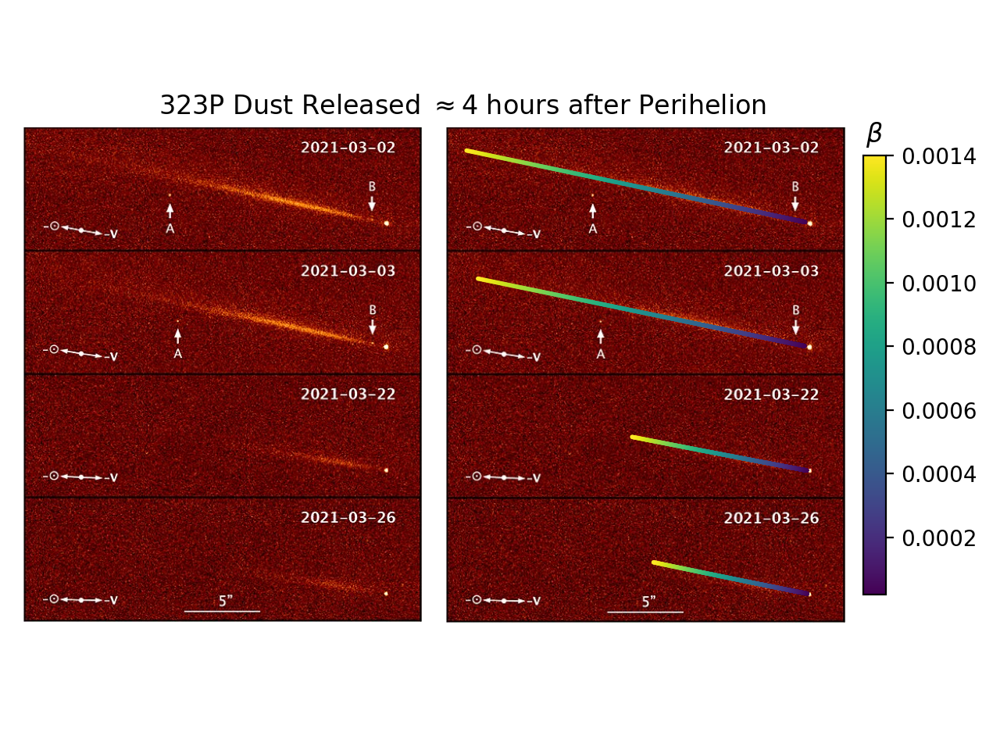

Comet 323P - Perihelion Activity
================================

Overview
--------

Original figure used in this tutorial is from the paper:

.. note::
    "The Lingering Death of Periodic Near-Sun Comet 323P/SOHO"
    Hui, Man-To, et al. The Astronomical Journal 164.1 (2022)

This tutorial demonstrates how to use the Kete to analyze the perihelion
activity of comet 323P, which was observed by the Hubble Space Telescope
in March 2021. The code below shows how to fetch the comet's state,
propagate it through time, and visualize the dust released around perihelion.

Preparation
-----------
Here we load the image of the comet, its state, and the dates of the
observations.

.. code-block:: python

    import kete
    import matplotlib.pyplot as plt
    import numpy as np
    from PIL import Image

    file = "data/Comet_323P_SOHO_by_HST_in_March_2021.jpg"

    image = np.asarray(Image.open(file))

    # Dates of observations
    dates = [kete.Time.from_ymd(2021, 3, 2),
             kete.Time.from_ymd(2021, 3, 3),
             kete.Time.from_ymd(2021, 3, 22),
             kete.Time.from_ymd(2021, 3, 26)]

    # Fetch the orbit from JPL Horizons
    state = kete.HorizonsProperties.fetch("323P").state

    # Generate some Field of View (FOV) for the dates of the observations.
    # Assume that the observer is in the middle of the Earth for simplicity.
    # This can be substituted for HST's position if you have a copy of HST's
    # SPICE kernel. Although as the image was a co-add, the position of HST will
    # be at multiple positions in orbit, and the center of Earth is a decent
    # approximation.
    fovs = [kete.OmniDirectionalFOV(kete.spice.get_state("Earth", t)) for t in dates]

    # Where was the comet observed at during the times specified.
    observations = kete.fov_state_check([state], fovs)

    # Compute the RA/DEC of the comet at the observation times.
    ra_dec_w_rates = np.array([o.ra_dec_with_rates[0] for o in observations])

Creating Dust Particles
-----------------------

To simulate the dust released by the comet, we will create a range of beta values
representing the relationship between the dust's particle size and its interactions
with solar radiation pressure.

Below we are essentially creating a Synchrone line, at a specific date where the
dust is released.

.. code-block:: python

    # How many days from perihelion to release dust.
    release_time = 0.19
    
    # What beta values to sample
    betas = np.logspace(np.log10(2e-5), np.log10(1.4e-3), 1000)

    # Propagate the comet state to perihelion + the release time.
    state = kete.propagate_n_body(state, state.peri_time + release_time)

    # Generate dust particles, and their associated non-gravitational models.
    dust = []
    non_gravs = []
    colors = []
    for beta in betas:
        colors.append(beta)
        non_gravs.append(kete.propagation.NonGravModel.new_dust(beta))
        dust.append(state)

Plot the results
----------------

In order to visualize our simulation results on the existing image,
we need several tools to enable the conversion from RA/DEC to pixels.

.. code-block:: python

    # Values below is to allow conversions from RA/DEC to
    # position on the existing figure.
    # These values were adjusted until they fit the image.

    # Degrees per pixel
    # The length of the 5" line is 296-203 pixels.
    px_scale = 5 / (296 - 203) / 60

    # Pixel origin at the lower right of each image
    origins = [[496, 154], [496, 308], [496, 462], [496, 616]]

    # pixel position of the comets center
    centers = np.array([[455, 120], [454, 275], [454, 430], [454, 584]])

    def convert_position_to_pixel(ra, dec, frame_idx):
        """
        Convert an ra/dec into a pixel position on the frames.
        frame_idx specifies which of the four frame, 0 being the top, 3
        the bottom.
        """
        x = ra / -px_scale + centers[frame_idx, 0] - ra_dec_w_rates[frame_idx, 0] / -px_scale
        y = dec / -px_scale + centers[frame_idx, 1] - ra_dec_w_rates[frame_idx, 1] / -px_scale
        origin = origins[frame_idx]
        xy = np.array([x, y])
        mask = xy[1] < origin[1]
        if frame_idx > 0:
            mask = mask & (xy[1] > origins[frame_idx - 1][1])
        xy = xy[:, mask]
        return xy.T, mask

Now we have the tools we need to convert simulation results to the pixel
positions on the image.

Below is a combination of the full simulation along with plotting of
the results.

.. code-block:: python

    fig, (ax0, ax1) = plt.subplots(1, 2, width_ratios=[1, 1.1], dpi=200)

    # Show the original image on both axes.
    ax0.imshow(image)
    ax0.set_axis_off()
    ax0.set_xlim(0, image.shape[1])
    ax0.set_ylim(image.shape[0], 0)

    ax1.imshow(image)
    ax1.set_axis_off()
    ax1.set_xlim(0, image.shape[1])
    ax1.set_ylim(image.shape[0], 0)

    # Calculate the position of the dust in pixel space.
    dust_positions = []
    dust_colors = []
    for idx, date in enumerate(dates):
        # Now for the simulation, first we need the observer position
        observer = kete.spice.get_state("Earth", date).pos

        # Propagate the dust particles to the date of observation.
        dust = kete.propagate_n_body(dust, date, non_gravs=non_gravs)

        # Adjust the position of the dust particles due to light delay
        # to the observer position.
        dust_light_delay = kete.propagate_two_body(dust, date, observer_pos=observer)

        # Now compute RA/DEC and convert to pixel positions.
        ra = np.array([(s.pos - observer).ra for s in dust_light_delay])
        dec = np.array([(s.pos - observer).dec for s in dust_light_delay])
        xy, mask = convert_position_to_pixel(ra, dec, idx)
        dust_positions.extend(xy)

        # Keep track of the colors for pretty plotting.
        dust_colors.extend(np.array(colors)[mask])
    
    # Overlay the dust on the right axis.
    plot = ax1.scatter(*np.array(dust_positions).T, s=1, c=dust_colors, alpha=1)
    colorbar = fig.colorbar(plot, fraction=0.05, pad=0.04)
    colorbar.ax.tick_params(labelsize=10)
    colorbar.ax.set_title(r"$\beta$")
    ax1.set_title(r"323P Dust Released $\approx4$ hours after Perihelion" + "   " * 15)
    plt.tight_layout()

    plt.savefig("data/323P_dust.png")
    plt.close()

