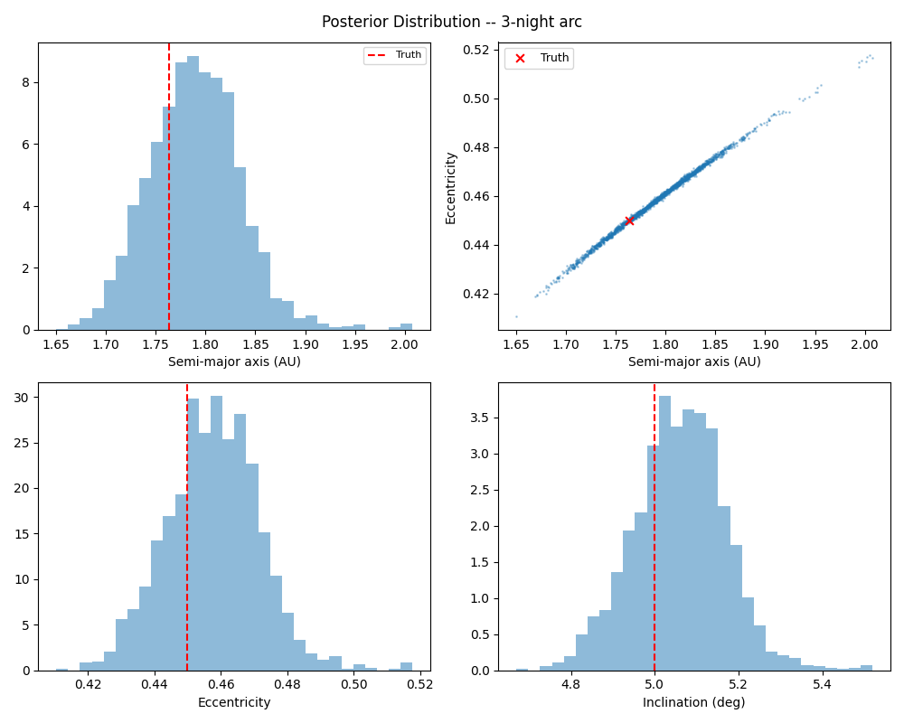
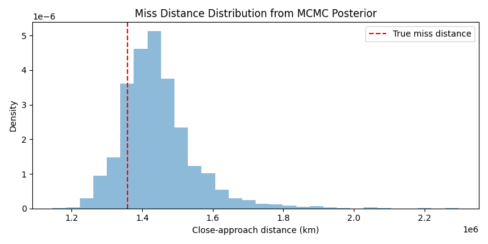
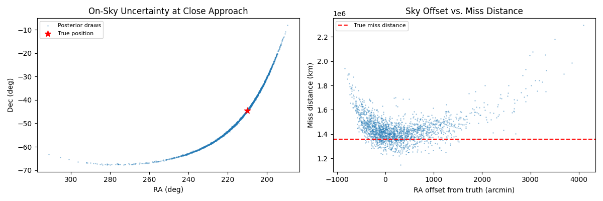

MCMC Posterior for a Near-Miss Asteroid
========================================

Overview
--------

When an asteroid is first discovered, we typically have only a handful of
observations spanning a few nights.  Standard orbit fitting
(:func:`~kete.fitting.fit_orbit`) produces a best-fit orbit and an uncertainty
estimate, but it assumes the uncertainty is Gaussian.  For short arcs this
assumption breaks down badly: the family of orbits consistent with the data
can be multi-modal, banana-shaped, or have long tails toward parabolic and
hyperbolic solutions.

:func:`~kete.fitting.fit_orbit_mcmc` makes no Gaussian assumption.  By
exploring the full space of possible orbits, it produces a set of orbit samples
that faithfully represent the true uncertainty -- however non-Gaussian it may
be.  This is essential for impact probability assessment, where the tails
of the distribution determine whether an Earth collision is possible.

This tutorial walks through the complete workflow on a synthetic example:

1. Build a realistic Apollo-type NEO orbit with a close Earth approach.
2. Generate six astrometric observations over three nights from Palomar.
3. Recover candidate orbits with initial orbit determination (IOD).
4. Estimate the orbit uncertainty with :func:`~kete.fitting.fit_orbit_mcmc`.
5. Propagate the sampled orbits to the close-approach epoch to assess the
   miss-distance distribution.

.. note::

   This example takes several minutes to run due to the MCMC sampling
   step.  Each orbit sample requires a full numerical
   propagation through all observations, which is why MCMC is
   reserved for short-arc cases where the Gaussian approximation is
   inadequate.

1. Build a Near-Miss Orbit
---------------------------

We construct an Apollo-type orbit (``a > 1 AU``, ``q < 1 AU``) with low
inclination.  The orbital orientation is chosen so that perihelion falls
near Earth's ecliptic longitude about 60 days after the observation epoch.
This produces a realistic discovery scenario: the object is first seen at
roughly 0.3 AU geocentric distance, and a close approach of about 0.04 AU
occurs a few weeks later.

.. code-block:: python

    import matplotlib.pyplot as plt
    import numpy as np
    import kete

    np.random.seed(42)

    epoch = kete.Time.from_ymd(2028, 9, 15)

    elements = kete.CometElements(
        desig="NearMiss",
        epoch=epoch,
        eccentricity=0.45,
        inclination=5.0,
        peri_arg=15.0,
        lon_of_ascending=40.0,
        peri_time=kete.Time(epoch.jd + 60),
        peri_dist=0.97,
    )
    true_state = elements.state
    print(f"True orbit: a={elements.semi_major:.3f} AU, "
          f"e={elements.eccentricity:.3f}, "
          f"i={elements.inclination:.1f} deg, "
          f"q={elements.peri_dist:.3f} AU")

::

    True orbit: a=1.764 AU, e=0.450, i=5.0 deg, q=0.970 AU

To verify the close approach, propagate the orbit forward 120 days and
record the geocentric distance at 6-hour intervals:

.. code-block:: python

    jd_start = epoch.jd
    jd_end = epoch.jd + 120
    step = 0.25  # 6-hour steps
    jds = np.arange(jd_start, jd_end, step)

    distances = []
    for jd in jds:
        state_at_jd = kete.propagate_n_body(true_state, jd)
        earth = kete.spice.get_state("Earth", jd)
        dist_au = (state_at_jd.pos - earth.pos).r
        distances.append(dist_au)

    min_dist = min(distances)
    min_jd = jds[np.argmin(distances)]
    print(f"Closest approach: {min_dist:.4f} AU "
          f"({min_dist * kete.constants.AU_KM:.0f} km) "
          f"at JD {min_jd:.2f}")

::

    Closest approach: 0.0091 AU (1358975 km) at JD 2462074.75

2. Generate Synthetic Observations
-----------------------------------

We simulate a realistic discovery scenario: three consecutive nights of
follow-up from Palomar Mountain (MPC observatory code 675), with two
observations per night separated by 1.5 hours.  This gives us a 48-hour
arc with 6 total astrometric measurements -- a common situation for a newly
discovered NEO before additional follow-up is obtained.

Each observation is given 0.3 arcsecond Gaussian noise, representative of
imperfect astrometry.  The RA uncertainty is inflated by ``1/cos(dec)``
to account for the convergence of right ascension lines toward the poles.

.. code-block:: python

    obs_night_start = epoch.jd
    obs_times = np.concatenate([
        obs_night_start + np.array([0.0, 1.5 / 24]),      # night 1
        obs_night_start + 1 + np.array([0.0, 1.5 / 24]),  # night 2
        obs_night_start + 2 + np.array([0.0, 1.5 / 24]),  # night 3
    ])

    fovs = []
    for jd in obs_times:
        observer = kete.spice.mpc_code_to_ecliptic("675", jd)
        fovs.append(kete.OmniDirectionalFOV(observer))

    visible = kete.fov_state_check([true_state], fovs)

    observations = []
    for vis in visible:
        observer = vis.fov.observer.as_equatorial.change_center(0)
        ra, dec, _, _ = vis.ra_dec_with_rates[0]

        sigma = 0.3  # arcsec
        obs = kete.fitting.Observation.optical(
            observer=observer,
            ra=ra + np.random.normal(0, sigma / 3600)
            / max(np.cos(np.radians(dec)), 0.1),
            dec=dec + np.random.normal(0, sigma / 3600),
            sigma_ra=sigma / max(np.cos(np.radians(dec)), 0.1),
            sigma_dec=sigma,
        )
        observations.append(obs)

    arc_hours = (obs_times[-1] - obs_times[0]) * 24
    print(f"Generated {len(observations)} observations "
          f"over {arc_hours:.1f} hours")

::

    Generated 6 observations over 49.5 hours

3. Initial Orbit Determination
-------------------------------

Before we can estimate the uncertainty, we need starting points.  The IOD
function scans a range of topocentric distances for each observation pair
and uses Lambert's problem to connect them, returning one or more candidate
orbits consistent with the data.

These raw IOD states are passed directly to :func:`~kete.fitting.fit_orbit_mcmc`
as seeds.  No prior orbit fit is needed -- the sampler will build its own
mass matrix from a single-pass linearization at each seed.

If IOD returns multiple candidates, the sampler runs separate chains from
each one and pools the results, which naturally captures multi-modality.

.. code-block:: python

    candidates = kete.fitting.initial_orbit_determination(observations)
    print(f"IOD returned {len(candidates)} candidate(s)")
    for i, c in enumerate(candidates):
        e = c.elements
        print(f"  [{i}] a={e.semi_major:.3f} AU, e={e.eccentricity:.3f}")

::

    IOD returned 5 candidate(s)
      [0] a=3.583 AU, e=0.745
      [1] a=-5.555 AU, e=1.164
      [2] a=-0.518 AU, e=2.674
      [3] a=-0.724 AU, e=2.250
      [4] a=-0.653 AU, e=2.875

4. Orbit Uncertainty Estimation
--------------------------------

:func:`~kete.fitting.fit_orbit_mcmc` uses an adaptive MCMC algorithm to
explore the space of orbits consistent with the observations.  Each step
requires a full numerical propagation, which is the dominant cost.

Key parameters:

- **num_draws**: Total orbit samples across all chains (after warmup).
  More samples give smoother histograms but take longer.
- **num_tune**: Warmup steps per chain for internal adaptation.
  500 is usually sufficient.  These are discarded.

The likelihood uses a Student-t distribution (nu=5) internally, which
automatically down-weights outlier observations.  This makes the sampler
robust when the initial orbit is poor or the stated uncertainties are
imperfect.

.. code-block:: python

    samples = kete.fitting.fit_orbit_mcmc(
        seeds=candidates,
        observations=observations,
        num_draws=2000,
        num_tune=500,
    )

    n_div = sum(samples.divergent)
    print(f"MCMC complete: {len(samples)} draws, "
          f"{len(set(samples.chain_id))} chain(s), "
          f"{n_div} divergent ({100*n_div/max(len(samples),1):.1f}%)")

::

    MCMC complete: 2000 draws, 4 chain(s), 0 divergent (0.0%)

A small fraction of divergent transitions is normal and those draws are
still valid posterior samples.  A high divergence rate (>10%) suggests the
posterior geometry is difficult and the results should be interpreted with
caution.

5. Visualize the Posterior
---------------------------

We convert each posterior draw to cometary orbital elements and plot their
distributions.  The red dashed lines mark the true values.

For short arcs the posterior is characteristically elongated along the
semi-major axis / eccentricity degeneracy: many different (a, e)
combinations produce orbits that pass through the same observed sky
positions.  This is the non-Gaussian structure that differential correction
alone cannot capture.

.. code-block:: python

    all_draws = samples.draws
    divergent = np.array(samples.divergent)
    good = ~divergent

    draw_states = [s for s, g in zip(all_draws, good) if g]
    chain_ids = np.array(samples.chain_id)[good]

    semi_majors = np.array([s.elements.semi_major for s in draw_states])
    eccentricities = np.array([s.elements.eccentricity for s in draw_states])
    inclinations = np.array([s.elements.inclination for s in draw_states])

    # Filter to bound orbits for plotting -- short-arc posteriors can
    # include near-parabolic or hyperbolic tails.
    bound = (semi_majors > 0) & (semi_majors < 10) & (eccentricities < 1)
    print(f"{bound.sum()} / {len(draw_states)} draws are "
          f"bound orbits with a < 10 AU")

::

    2000 / 2000 draws are bound orbits with a < 10 AU

.. code-block:: python

    fig, axes = plt.subplots(2, 2, figsize=(10, 8))
    fig.suptitle("Posterior Distribution -- 3-night arc")

    ax = axes[0, 0]
    ax.hist(semi_majors[bound], bins=30, density=True, alpha=0.5)
    ax.axvline(elements.semi_major, color="red", ls="--", label="Truth")
    ax.set_xlabel("Semi-major axis (AU)")
    ax.legend(fontsize=8)

    ax = axes[0, 1]
    ax.scatter(semi_majors[bound], eccentricities[bound], s=1, alpha=0.3)
    ax.scatter(elements.semi_major, elements.eccentricity,
               c="red", s=40, marker="x", label="Truth")
    ax.set_xlabel("Semi-major axis (AU)")
    ax.set_ylabel("Eccentricity")
    ax.legend(fontsize=9)

    ax = axes[1, 0]
    ax.hist(eccentricities[bound], bins=30, density=True, alpha=0.5)
    ax.axvline(elements.eccentricity, color="red", ls="--")
    ax.set_xlabel("Eccentricity")

    ax = axes[1, 1]
    ax.hist(inclinations[bound], bins=30, density=True, alpha=0.5)
    ax.axvline(elements.inclination, color="red", ls="--")
    ax.set_xlabel("Inclination (deg)")

    plt.tight_layout()
    plt.savefig("data/mcmc_posterior.png")
    plt.close()

The (a, e) scatter plot in the upper right is the most revealing: instead
of a compact Gaussian blob, the posterior traces out a curved ridge.  Every
point along this ridge is an orbit that fits the three nights of data
nearly equally well.  This is the fundamental reason why Gaussian
uncertainty (a single ellipse in this space) is inadequate for short arcs.

6. Close-Approach Distance Distribution
-----------------------------------------

The practical payoff of having the full posterior: we can propagate every
sample to the predicted close-approach epoch and compute the distribution
of miss distances.  This directly answers the question "given what we know
from three nights of data, how close could this object come to Earth?"

.. code-block:: python

    bound_states = [s for s, b in zip(draw_states, bound) if b]
    miss_km = []
    for s in bound_states:
        s_ca = kete.propagate_n_body(s, min_jd)
        earth = kete.spice.get_state("Earth", min_jd)
        miss_km.append((s_ca.pos - earth.pos).r * kete.constants.AU_KM)

    miss_km = np.array(miss_km)

    fig, ax = plt.subplots(figsize=(8, 4))
    ax.hist(miss_km, bins=30, density=True, alpha=0.5)
    ax.axvline(min_dist * kete.constants.AU_KM, color="red", ls="--",
               label="True miss distance")
    ax.set_xlabel("Close-approach distance (km)")
    ax.set_ylabel("Density")
    ax.set_title("Miss Distance Distribution from MCMC Posterior")
    ax.legend()
    plt.tight_layout()
    plt.savefig("data/mcmc_miss_distance.png")
    plt.close()

.. code-block:: python

    pct_5, pct_50, pct_95 = np.percentile(miss_km, [5, 50, 95])
    print(f"Miss distance (km):  5th={pct_5:.0f}, "
          f"median={pct_50:.0f}, 95th={pct_95:.0f}")
    print(f"True miss distance:  "
          f"{min_dist * kete.constants.AU_KM:.0f} km")

::

    Miss distance (km):  5th=1308289, median=1439840, 95th=1637960
    True miss distance:  1358975 km

The spread of the miss-distance histogram illustrates how uncertain the
close-approach geometry remains with only three nights of data.  In a real
scenario this distribution would be used to compute an impact probability
by counting the fraction of samples that pass within Earth's cross-section.

7. On-Sky Uncertainty During Close Approach
---------------------------------------------

The most operationally useful output of the MCMC posterior is the
uncertainty region on the sky at the close-approach epoch.  If an observer
wants to recover this object, they need to know not just the best-guess
position but how large a patch of sky to search.

We propagate every posterior sample to the close-approach epoch and compute
the apparent RA/Dec as seen from Palomar.  The scatter of those positions
on the sky is the search region.

.. code-block:: python

    # Propagate each posterior draw to the close-approach epoch and
    # compute apparent RA/Dec from Palomar.
    obs_ca = kete.spice.mpc_code_to_ecliptic("675", min_jd)
    fov_ca = kete.OmniDirectionalFOV(obs_ca)

    sample_ra = []
    sample_dec = []
    for s in bound_states:
        s_ca = kete.propagate_n_body(s, min_jd)
        vis = kete.fov_state_check([s_ca], [fov_ca])
        if len(vis) > 0:
            ra, dec, _, _ = vis[0].ra_dec_with_rates[0]
            sample_ra.append(ra)
            sample_dec.append(dec)

    sample_ra = np.array(sample_ra)
    sample_dec = np.array(sample_dec)

    # True position for comparison
    true_ca = kete.propagate_n_body(true_state, min_jd)
    vis_true = kete.fov_state_check([true_ca], [fov_ca])
    true_ra, true_dec, _, _ = vis_true[0].ra_dec_with_rates[0]

    # Spread in arcminutes
    cos_dec = np.cos(np.radians(np.median(sample_dec)))
    ra_spread = (np.ptp(sample_ra) * 60 * cos_dec)
    dec_spread = (np.ptp(sample_dec) * 60)
    print(f"On-sky uncertainty at close approach:")
    print(f"  RA spread:  {ra_spread:.1f} arcmin")
    print(f"  Dec spread: {dec_spread:.1f} arcmin")
    print(f"  Samples plotted: {len(sample_ra)}")

::

    On-sky uncertainty at close approach:
      RA spread:  4412.0 arcmin
      Dec spread: 3204.0 arcmin
      Samples plotted: 2000

.. code-block:: python

    fig, axes = plt.subplots(1, 2, figsize=(12, 4))

    # Left: RA/Dec scatter of posterior draws at close approach
    ax = axes[0]
    ax.scatter(sample_ra, sample_dec, s=1, alpha=0.3, label="Posterior draws")
    ax.scatter(true_ra, true_dec, c="red", s=80, marker="*",
               zorder=5, label="True position")
    ax.set_xlabel("RA (deg)")
    ax.set_ylabel("Dec (deg)")
    ax.set_title("On-Sky Uncertainty at Close Approach")
    ax.legend(fontsize=8)
    ax.invert_xaxis()

    # Right: miss distance vs RA offset (shows correlation structure)
    ax = axes[1]
    ra_offset_arcmin = (sample_ra[:len(miss_km)] - true_ra) * 60 * cos_dec
    ax.scatter(ra_offset_arcmin, miss_km, s=1, alpha=0.3)
    ax.axhline(min_dist * kete.constants.AU_KM, color="red", ls="--",
               label="True miss distance")
    ax.set_xlabel("RA offset from truth (arcmin)")
    ax.set_ylabel("Miss distance (km)")
    ax.set_title("Sky Offset vs. Miss Distance")
    ax.legend(fontsize=8)

    plt.tight_layout()
    plt.savefig("data/mcmc_sky_track.png")
    plt.close()

The left panel shows the search region an observer would need to tile to
guarantee recovery.  The spread can be many arcminutes -- far larger than
a typical CCD field of view -- underscoring why short-arc uncertainty
matters for follow-up planning.

The right panel reveals the correlation between sky-plane offset and miss
distance: samples that appear farther from the nominal position also tend
to have different close-approach geometries.  This coupling between
on-sky uncertainty and physical miss distance is a hallmark of short-arc
NEO problems.

When to Use MCMC vs. Standard Orbit Fitting
----------------------------------------------

MCMC (:func:`~kete.fitting.fit_orbit_mcmc`) is powerful but expensive.
Here are guidelines for choosing the right tool:

- **Long, well-sampled arcs** (months to years of observations): use
  :func:`~kete.fitting.fit_orbit` alone.  The Gaussian
  approximation is excellent and the uncertainty from least squares
  is reliable.

- **Short arcs** (a few nights) where the uncertainty is non-Gaussian: use
  :func:`~kete.fitting.fit_orbit_mcmc`.  The cost is justified because the
  shape of the uncertainty matters for risk assessment.

- **Intermediate cases**: run :func:`~kete.fitting.fit_orbit` first.  If the
  uncertainty is suspiciously large or the orbit is poorly constrained,
  follow up with MCMC.

The MCMC sampler accepts raw IOD states as seeds, so no preliminary
orbit fit is required -- though providing a converged fit as
a seed can improve sampling efficiency.
