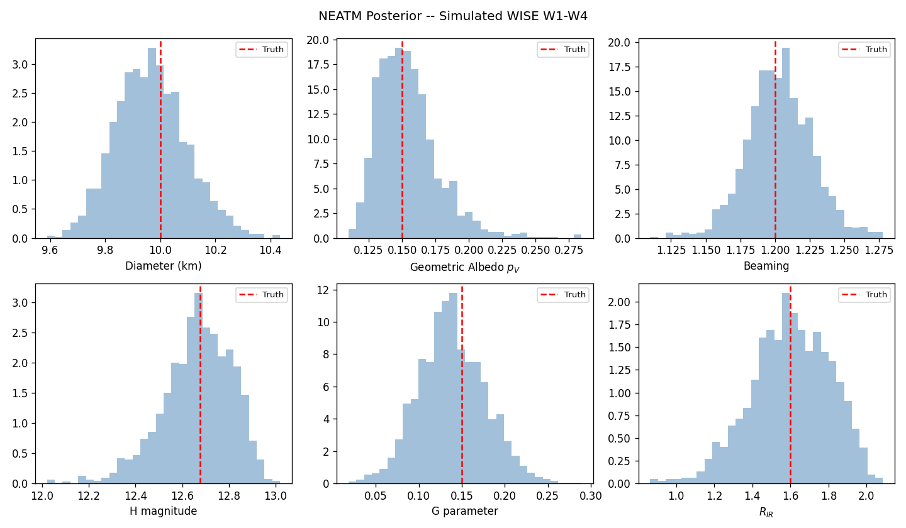
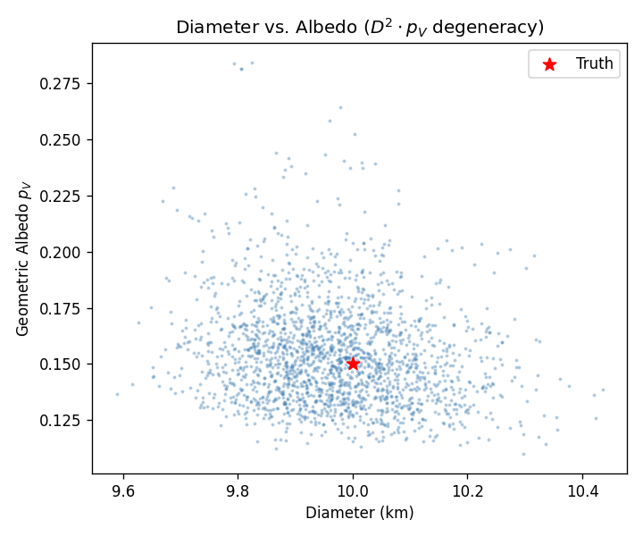
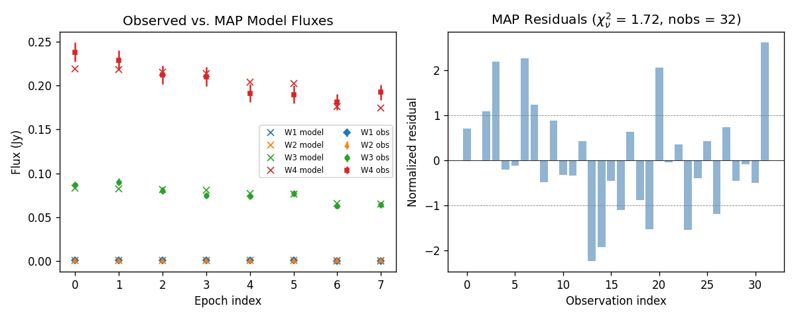
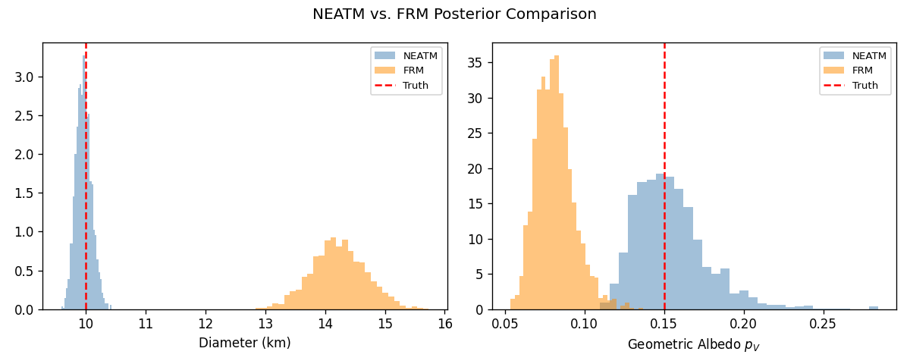
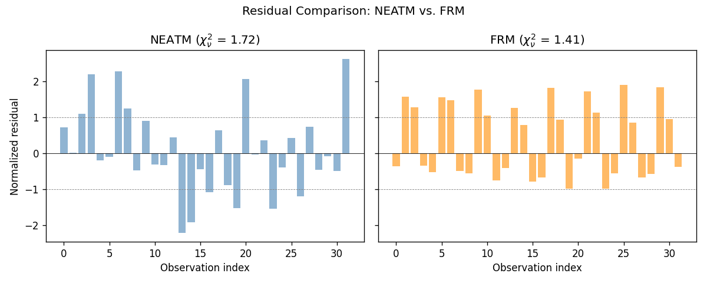

NEATM Thermal Fitting with Simulated WISE Data
=================================================

Overview
--------

This tutorial demonstrates the full workflow of thermal model fitting
using the NEATM (Near-Earth Asteroid Thermal Model).  We will:

1. Define a synthetic asteroid with known physical properties.
2. Construct a realistic orbit and compute observation geometries.
3. Simulate WISE W1--W4 band flux measurements with noise.
4. Fit the NEATM model to those observations using MCMC.
5. Compare the recovered posterior to the true input parameters.

This is the standard workflow for characterizing asteroid diameters and
albedos from mid-infrared survey data.  We include all four WISE bands:
W1 (3.4 um), W2 (4.6 um), W3 (12 um), and W4 (22 um).  The shorter
wavelength bands carry reflected-light information while W3 and W4 are
dominated by thermal emission.

.. note::

   This example takes about a minute to run due to the MCMC sampling
   step.

1. Define the True Asteroid
-----------------------------

We choose physical properties typical of a moderate-albedo S-type
main-belt asteroid:

.. code-block:: python

    import matplotlib.pyplot as plt
    import numpy as np
    import kete

    np.random.seed(42)

    # True physical parameters
    # km
    true_diam = 10.0
    # geometric albedo
    true_vis_albedo = 0.15
    # NEATM beaming parameter
    true_beaming = 1.2
    # HG phase parameter
    true_g_param = 0.15
    # thermal emissivity (fixed, not fitted)
    true_emissivity = 0.9
    # IR-to-visible albedo ratio
    true_r_ir = 1.6

    # Derive H magnitude from diameter and albedo
    true_h_mag = kete.compute_h_mag(true_diam, true_vis_albedo)
    print(f"True parameters:")
    print(f"  Diameter:  {true_diam} km")
    print(f"  Albedo:    {true_vis_albedo}")
    print(f"  H mag:     {true_h_mag:.2f}")
    print(f"  Beaming:   {true_beaming}")
    print(f"  G param:   {true_g_param}")
    print(f"  R_IR:      {true_r_ir}")

::

    True parameters:
      Diameter:  10.0 km
      Albedo:    0.15
      H mag:     12.68
      Beaming:   1.2
      G param:   0.15
      R_IR:      1.6

2. Build an Orbit and Compute Geometries
------------------------------------------

We construct a main-belt orbit and pick several observation epochs spread
across a lunation.  At each epoch we compute the Sun-to-object and
Sun-to-observer (Earth) vectors, which define the observation geometry.

.. code-block:: python

    # Main-belt orbit
    epoch = kete.Time.from_ymd(2024, 3, 15)
    elements = kete.CometElements(
        desig="TestAsteroid",
        epoch=epoch,
        eccentricity=0.08,
        inclination=10.0,
        peri_arg=75.0,
        lon_of_ascending=45.0,
        peri_time=kete.Time(epoch.jd - 200),
        peri_dist=2.5,
    )
    state = elements.state
    print(f"Orbit: a={elements.semi_major:.3f} AU, "
          f"e={elements.eccentricity:.3f}, "
          f"i={elements.inclination:.1f} deg")

::

    Orbit: a=2.717 AU, e=0.080, i=10.0 deg

Simulate 8 observations spread over 30 days, representing repeated
WISE scans of the same field:

.. code-block:: python

    obs_jds = epoch.jd + np.array([0, 1, 5, 6, 14, 15, 29, 30])
    print(f"Observing over {obs_jds[-1] - obs_jds[0]:.0f} day arc")

    geometries = []
    for jd in obs_jds:
        obj_state = kete.propagate_two_body(state, jd)
        earth = kete.spice.get_state("Earth", jd)
        sun2obj = obj_state.pos
        sun2obs = earth.pos
        geometries.append((sun2obj, sun2obs))

    # Print example geometry
    sun2obj_0, sun2obs_0 = geometries[0]
    helio_dist = sun2obj_0.r
    geo_dist = (sun2obj_0 - sun2obs_0).r
    print(f"First epoch:  r_helio={helio_dist:.3f} AU, "
          f"r_geo={geo_dist:.3f} AU")

::

    Observing over 30 day arc
    First epoch:  r_helio=2.570 AU, r_geo=1.594 AU

3. Simulate WISE Observations
-------------------------------

We use :class:`~kete.flux.NeatmParams` to compute the true thermal
+ reflected flux in all four WISE bands, then add Gaussian noise to
simulate real measurements.

.. code-block:: python

    ir_albedo = true_r_ir * true_vis_albedo
    band_names = ["W1", "W2", "W3", "W4"]

    params = kete.flux.NeatmParams.new_wise(
        band_albedos=[ir_albedo] * 4,
        h_mag=true_h_mag,
        vis_albedo=true_vis_albedo,
        beaming=true_beaming,
        g_param=true_g_param,
        emissivity=true_emissivity,
    )

    # Evaluate the model at each geometry
    sun2obj_list = [g[0] for g in geometries]
    sun2obs_list = [g[1] for g in geometries]
    model_outputs = params.evaluate(sun2obj_list, sun2obs_list)

    # Extract true fluxes for all four bands
    true_fluxes = {}
    for idx, name in enumerate(band_names):
        true_fluxes[name] = [out.fluxes[idx] for out in model_outputs]

    for name in band_names:
        print(f"True {name} fluxes (Jy): "
              f"{[f'{f:.4f}' for f in true_fluxes[name]]}")

Now add 5% Gaussian noise to create the observed fluxes, and package
them as :class:`~kete.flux.FluxObs` objects:

.. code-block:: python

    # 5% flux uncertainty
    sigma_frac = 0.05
    observations = []

    for i, (sun2obj, sun2obs) in enumerate(geometries):
        for name in band_names:
            true_flux = true_fluxes[name][i]
            sigma = sigma_frac * true_flux
            noisy_flux = true_flux + np.random.normal(0, sigma)
            obs = kete.flux.FluxObs(
                flux=noisy_flux,
                sigma=sigma,
                band=name,
                sun2obj=sun2obj,
                sun2obs=sun2obs,
            )
            observations.append(obs)

    n_bands = len(band_names)
    print(f"Created {len(observations)} FluxObs "
          f"({len(observations) // n_bands} epochs x {n_bands} bands)")

::

    True W1 fluxes (Jy): ['0.0007', '0.0007', '0.0006', '0.0006', '0.0006', '0.0005', '0.0004', '0.0004']
    True W2 fluxes (Jy): ['0.0008', '0.0008', '0.0008', '0.0008', '0.0007', '0.0007', '0.0006', '0.0006']
    True W3 fluxes (Jy): ['0.0838', '0.0836', '0.0823', '0.0818', '0.0776', '0.0770', '0.0668', '0.0660']
    True W4 fluxes (Jy): ['0.2212', '0.2206', '0.2173', '0.2163', '0.2058', '0.2042', '0.1780', '0.1760']
    Created 32 FluxObs (8 epochs x 4 bands)

4. Run MCMC Fitting
---------------------

We call :func:`~kete.flux.fit_model` with ``model="neatm"``.
Passing ``h_mag`` as a convenience argument centers the H-magnitude
prior on our approximate value (in a real scenario this would come
from optical-survey photometry).

The fitter explores 6 parameters:
``[D, beaming, H, G, f_sigma, R_IR]``
and returns posterior draws in physical units.

.. code-block:: python

    result = kete.flux.fit_model(
        model="neatm",
        obs=observations,
        h_mag=true_h_mag,
        g_param=true_g_param,
        emissivity=true_emissivity,
        num_chains=4,
        num_tune=200,
        num_draws=500,
    )

    print(f"MCMC complete: {len(result.draws)} draws, "
          f"{result.n_divergent} divergent")
    print(f"reduced chi2 = {result.chi2_best:.2f} "
          f"(nobs = {result.nobs}, dof = {result.nobs - 6})")
    print(f"\nPosterior summary:")
    print(f"  Diameter:  {result.diameter}")
    print(f"  Albedo:    {result.vis_albedo}")
    print(f"  Beaming:   {result.beaming}")
    print(f"  H mag:     {result.h_mag}")
    print(f"  G param:   {result.g_param}")
    print(f"  R_IR:      {result.ir_albedo_ratio}")

::

    MCMC complete: 2000 draws, 0 divergent
    reduced chi2 = 1.27 (nobs = 32, dof = 26)

    Posterior summary:
    Diameter:  SampleStats(median=9.9621, std=0.1297, ci=[9.7316, 10.2383])
    Albedo:    SampleStats(median=0.1511, std=0.0229, ci=[0.1213, 0.2066])
    Beaming:   SampleStats(median=1.2035, std=0.0237, ci=[1.1569, 1.2505])
    H mag:     SampleStats(median=12.6745, std=0.1496, ci=[12.3363, 12.9049])
    G param:   SampleStats(median=0.1368, std=0.0388, ci=[0.0662, 0.2169])
    R_IR:      SampleStats(median=1.6059, std=0.2071, ci=[1.1802, 1.9611])

5. Visualize the Posterior
---------------------------

We plot histograms of the key fitted parameters with the true values
overlaid.  The NEATM draw columns are
``[diameter, vis_albedo, beaming, h_mag, g_param, ir_albedo_ratio, f_sigma]``.

.. code-block:: python

    draws = np.array(result.draws)
    columns = result.columns
    true_vals = {
        "diameter": true_diam,
        "vis_albedo": true_vis_albedo,
        "beaming": true_beaming,
        "h_mag": true_h_mag,
        "g_param": true_g_param,
        "ir_albedo_ratio": true_r_ir,
    }
    labels = {
        "diameter": "Diameter (km)",
        "vis_albedo": r"Geometric Albedo $p_V$",
        "beaming": "Beaming",
        "h_mag": "H magnitude",
        "g_param": "G parameter",
        "ir_albedo_ratio": r"$R_{IR}$",
    }

    fig, axes = plt.subplots(2, 3, figsize=(12, 7))
    fig.suptitle("NEATM Posterior -- Simulated WISE W1-W4")

    for ax, col_name in zip(axes.flat, labels):
        idx = columns.index(col_name)
        vals = draws[:, idx]
        ax.hist(vals, bins=30, density=True, alpha=0.5, color="steelblue")
        ax.axvline(true_vals[col_name], color="red", ls="--",
                   lw=1.5, label="Truth")
        ax.set_xlabel(labels[col_name])
        ax.legend(fontsize=8)

    plt.tight_layout()
    plt.savefig("data/neatm_fit_posterior.png", dpi=120)
    plt.close()

The posterior distributions should be centered near the true values
(red dashed lines), confirming that the MCMC sampler successfully
recovers the input parameters from noisy thermal data.

6. Diameter--Albedo Degeneracy
-------------------------------

A hallmark of thermal fitting is the strong anti-correlation between
diameter and albedo: a smaller, brighter asteroid can produce the same
thermal flux as a larger, darker one.  We visualize this by
plotting the joint posterior:

.. code-block:: python

    d_idx = columns.index("diameter")
    pv_idx = columns.index("vis_albedo")

    fig, ax = plt.subplots(figsize=(6, 5))
    ax.scatter(draws[:, d_idx], draws[:, pv_idx],
               s=2, alpha=0.3, color="steelblue")
    ax.scatter(true_diam, true_vis_albedo,
               c="red", s=80, marker="*", zorder=5, label="Truth")
    ax.set_xlabel("Diameter (km)")
    ax.set_ylabel(r"Geometric Albedo $p_V$")
    ax.set_title(r"Diameter vs. Albedo ($D^2 \cdot p_V$ degeneracy)")
    ax.legend()
    plt.tight_layout()
    plt.savefig("data/neatm_fit_diam_albedo.png", dpi=120)
    plt.close()

The banana-shaped scatter reflects the constraint imposed by H magnitude:
:math:`D = C_{HG} / \sqrt{p_V} \times 10^{-H/5}`.  Every draw lies on
the curve defined by the fitted H; the spread along the curve is
determined by the thermal data.

7. Residuals and Model Fit Quality
------------------------------------

The MAP (maximum a posteriori) fit provides best-fit fluxes and
normalized residuals for each observation.  Well-behaved residuals
should scatter around zero with unit variance.

.. code-block:: python

    residuals = np.array(result.best_fit_residuals)
    fit_fluxes = np.array(result.best_fit_fluxes)
    obs_fluxes = np.array([o.flux for o in observations])

    # Group observation indices by band
    band_idx = {name: list(range(k, len(observations), n_bands))
                for k, name in enumerate(band_names)}
    markers = {"W1": "D", "W2": "^", "W3": "o", "W4": "s"}
    colors = {"W1": "C0", "W2": "C1", "W3": "C2", "W4": "C3"}

    fig, axes = plt.subplots(1, 2, figsize=(10, 4))

    ax = axes[0]
    for name in band_names:
        idx = band_idx[name]
        ax.errorbar(range(len(idx)), obs_fluxes[idx],
                    yerr=[observations[i].sigma for i in idx],
                    fmt=markers[name], ms=4, label=f"{name} obs",
                    color=colors[name])
        ax.plot(range(len(idx)), fit_fluxes[idx], "x",
                ms=6, color=colors[name], label=f"{name} model")
    ax.set_xlabel("Epoch index")
    ax.set_ylabel("Flux (Jy)")
    ax.set_title("Observed vs. MAP Model Fluxes")
    ax.legend(fontsize=7, ncol=2)

    ax = axes[1]
    ax.bar(range(len(residuals)), residuals, color="steelblue", alpha=0.6)
    ax.axhline(0, color="black", lw=0.5)
    ax.axhline(1, color="gray", ls="--", lw=0.5)
    ax.axhline(-1, color="gray", ls="--", lw=0.5)
    ax.set_xlabel("Observation index")
    ax.set_ylabel("Normalized residual")
    ax.set_title(f"MAP Residuals ($\\chi^2_\\nu$ = {result.chi2_best:.2f}, "
                 f"nobs = {result.nobs})")
    plt.tight_layout()
    plt.savefig("data/neatm_fit_residuals.png", dpi=120)
    plt.close()

Residuals within :math:`\pm 1` indicate a good fit.  A reduced
:math:`\chi^2_\nu` near 1.0 indicates the model explains the
data at the level of the measurement noise.

8. Customizing Priors
----------------------

The default priors work well for most cases, but they can be customized
via :class:`~kete.flux.FluxPriors` and :class:`~kete.flux.ParamPrior`.
For example, to tighten the beaming prior around 1.0:

.. code-block:: python

    custom_priors = kete.flux.FluxPriors(
        beaming=kete.flux.ParamPrior(
            bounds=(0.5, 3.0),
            # tighter sigma
            gaussian=(1.0, 0.1),
        ),
    )
    result_custom = kete.flux.fit_model(
        model="neatm",
        obs=observations,
        h_mag=true_h_mag,
        g_param=true_g_param,
        priors=custom_priors,
        num_chains=4,
        num_tune=200,
        num_draws=500,
    )
    print(f"Default beaming: {result.beaming}")
    print(f"Custom  beaming: {result_custom.beaming}")

::

    Default beaming: SampleStats(median=1.2048, std=0.0221, ci=[1.1618, 1.2513])
    Custom  beaming: SampleStats(median=1.1971, std=0.0214, ci=[1.1559, 1.2436])

The tighter prior narrows the posterior, which can be useful when
external information constrains the beaming parameter.

9. NEATM vs. FRM: Model Mismatch
----------------------------------

The FRM (Fast Rotating Model) assumes the asteroid rotates fast enough
that surface temperature is uniform at each latitude.  This is
physically different from NEATM, which concentrates thermal emission
on the sub-solar hemisphere with an adjustable beaming parameter.

Since our synthetic data were generated with NEATM (beaming = 1.2), fitting
with FRM should produce a poorer fit: the wrong thermal distribution will
force the fitter to compensate by shifting diameter and albedo.

.. code-block:: python

    result_frm = kete.flux.fit_model(
        model="frm",
        obs=observations,
        h_mag=true_h_mag,
        g_param=true_g_param,
        emissivity=true_emissivity,
        num_chains=4,
        num_tune=200,
        num_draws=500,
    )

    print("FRM posterior summary:")
    print(f"  Diameter:  {result_frm.diameter}")
    print(f"  Albedo:    {result_frm.vis_albedo}")
    print(f"  H mag:     {result_frm.h_mag}")
    print(f"  R_IR:      {result_frm.ir_albedo_ratio}")
    print(f"  reduced chi2: {result_frm.chi2_best:.2f} "
          f"(nobs = {result_frm.nobs}, dof = {result_frm.nobs - 5})")
    print(f"\nNEATM reduced chi2: {result.chi2_best:.2f}")
    print(f"FRM  reduced chi2:  {result_frm.chi2_best:.2f}")

::

    FRM posterior summary:
      Diameter:  SampleStats(median=14.1470, std=0.4187, ci=[13.3563, 14.9973])
      Albedo:    SampleStats(median=0.0749, std=0.0045, ci=[0.0666, 0.0842])
      H mag:     SampleStats(median=12.6776, std=0.0099, ci=[12.6579, 12.6967])
      R_IR:      SampleStats(median=1.7725, std=0.1077, ci=[1.5556, 1.9778])
      reduced chi2: 2.13 (nobs = 32, dof = 27)

    NEATM reduced chi2: 1.27
    FRM  reduced chi2:  2.13

Compare the diameter and albedo posteriors side by side:

.. code-block:: python

    draws_frm = np.array(result_frm.draws)
    columns_frm = result_frm.columns

    fig, axes = plt.subplots(1, 2, figsize=(10, 4))

    for ax, col_name, label, true_val in [
        (axes[0], "diameter", "Diameter (km)", true_diam),
        (axes[1], "vis_albedo", r"Geometric Albedo $p_V$", true_vis_albedo),
    ]:
        neatm_vals = draws[:, columns.index(col_name)]
        frm_vals = draws_frm[:, columns_frm.index(col_name)]
        ax.hist(neatm_vals, bins=30, density=True, alpha=0.5,
                color="steelblue", label="NEATM")
        ax.hist(frm_vals, bins=30, density=True, alpha=0.5,
                color="darkorange", label="FRM")
        ax.axvline(true_val, color="red", ls="--", lw=1.5, label="Truth")
        ax.set_xlabel(label)
        ax.legend(fontsize=8)

    fig.suptitle("NEATM vs. FRM Posterior Comparison")
    plt.tight_layout()
    plt.savefig("data/neatm_vs_frm_posterior.png", dpi=120)
    plt.close()

Now compare the residuals from both models:

.. code-block:: python

    residuals_frm = np.array(result_frm.best_fit_residuals)

    fig, axes = plt.subplots(1, 2, figsize=(10, 4), sharey=True)

    ax = axes[0]
    ax.bar(range(len(residuals)), residuals, color="steelblue", alpha=0.6)
    ax.axhline(0, color="black", lw=0.5)
    ax.axhline(1, color="gray", ls="--", lw=0.5)
    ax.axhline(-1, color="gray", ls="--", lw=0.5)
    ax.set_xlabel("Observation index")
    ax.set_ylabel("Normalized residual")
    ax.set_title(f"NEATM ($\\chi^2_\\nu$ = {result.chi2_best:.2f})")

    ax = axes[1]
    ax.bar(range(len(residuals_frm)), residuals_frm, color="darkorange", alpha=0.6)
    ax.axhline(0, color="black", lw=0.5)
    ax.axhline(1, color="gray", ls="--", lw=0.5)
    ax.axhline(-1, color="gray", ls="--", lw=0.5)
    ax.set_xlabel("Observation index")
    ax.set_title(f"FRM ($\\chi^2_\\nu$ = {result_frm.chi2_best:.2f})")

    fig.suptitle("Residual Comparison: NEATM vs. FRM")
    plt.tight_layout()
    plt.savefig("data/neatm_vs_frm_residuals.png", dpi=120)
    plt.close()

The FRM fit shows larger residuals and a higher :math:`\chi^2` because the
assumed thermal distribution does not match the data.  The diameter and
albedo posteriors are shifted away from the true values as the model
compensates for the wrong temperature profile.  This illustrates why
model selection matters: when beaming departs from :math:`\pi`, NEATM
provides a better description of the thermal emission than FRM.
