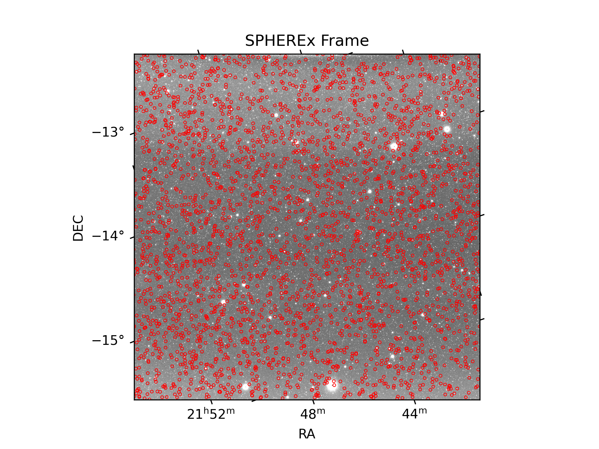

SPHEREx
=======

SPHEREx is a IR space telescope with a linear variable filter. Every pixel
corresponds to a linearly varying spectral sample across the detectors.

Every time it images an asteroid or comet it will be sampling a different
part of the spectrum of that object.

Here is a small worked example of identifying where every known object lands
in all of the public data that has been released so far for this telescope.

.. code-block:: python

    import kete
    import matplotlib.pyplot as plt
    import numpy as np

Fields of View and States
-------------------------

First we download all of the fields of view that have been released so far 
for SPHEREx. 

.. code-block:: python

    # Download all of the fields of view from IRSA.
    # This does not download the images! This only downloads the metadata
    # which describes the position on sky of every frame.
    # The SPICE kernel for SPHEREx is not publicly available, as a result of this
    # This uses a custom SPICE kernel, built from publicly available data.
    # THIS IS NOT AN OFFICIAL KERNEL! However it matches the positions available
    # on JPL Horizons to within about 30km.
    fovs = kete.spherex.fetch_fovs()

    # Load the list of all known objects from the MPC.
    # This contains a complete list of all asteroids.
    table = kete.mpc.fetch_known_orbit_data()
    states = kete.conversion.table_to_states(table)

    # About a dozen of these objects have hit the earth, we need to remove them
    states = kete.propagate_n_body(states, fovs[0].jd, suppress_impact_errors=True)
    states = [s for s in states if s.is_finite]

What is in frame!
-----------------

Perform N-body propagation for every object in every frame, this result typically
matches horizons to within a few km per decade.

.. note::
    This takes about 5 minutes to run on a laptop, as it is performing
    orbit propagation using full N-Body mechanics of all planets with corrections for
    general relativity. This is propagating the *entire* MPC catalog.

.. code-block:: python

    # Compute what object lands in every frame.
    visible = kete.fov_state_check(states, fovs)

The Busiest Frame
-----------------

Plotting the frame with the most objects in it.

.. code-block:: python

    indices = np.argsort([-len(v) for v in visible])[:10]
    idx = indices[1]

    plt.figure(dpi=300)

    fov = visible[idx].fov
    frame = kete.spherex.fetch_frame(fov)
    wcs = kete.plot.plot_fits_image(frame, percentiles=None)

    for idx, vec in enumerate(visible[idx].obs_vecs):
        kete.plot.annotate_plot(wcs, vec, style='o', px_gap=1, lw=0.5)
    plt.xlim(0, frame.data.shape[0])
    plt.ylim(0, frame.data.shape[1])
    plt.title(f"SPHEREx Frame")
    plt.savefig("data/spherex.png")
    plt.close()

